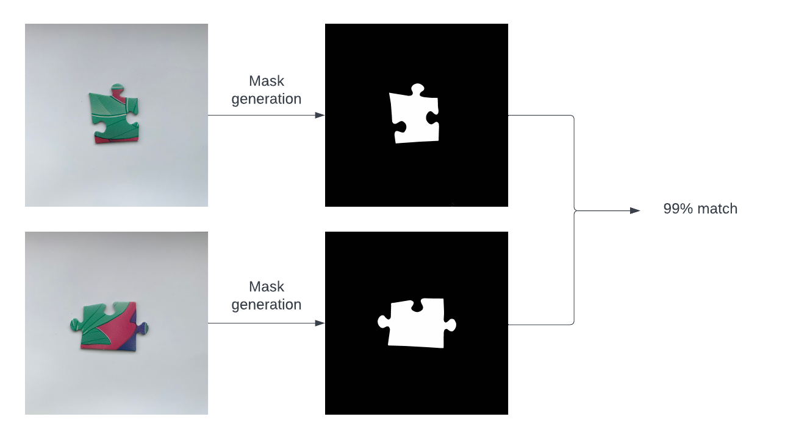

# PiecePerfect

Our app aims to help restorers in matching different fragments of artifacts. The user is asked to enter images belonging to different pieces, select the fragment they want to match, and <i>PiecePerfect</i> will find
the pieces with the best match. For now, the app can only find matches for puzzle pieces, but we aim to
expand the range of applicability in the future.

The pipeline for piece matching is exposed in the picture above. The program 
generates a mask for each image with a U-Net model. Then, for a selected image,
it computes matching probabilities between that image and all the other ones, 
using a Siamese Neural Network.